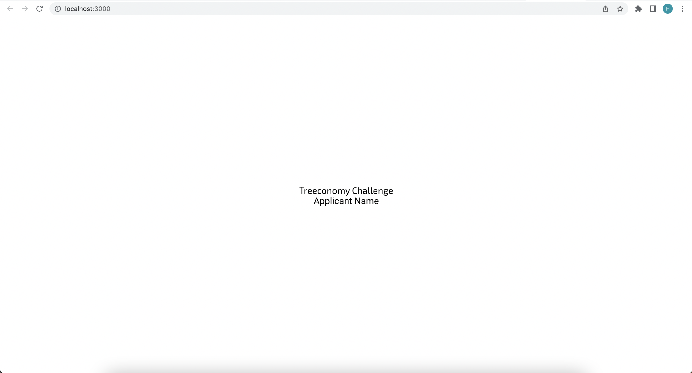
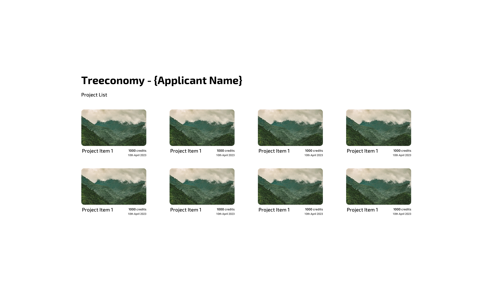
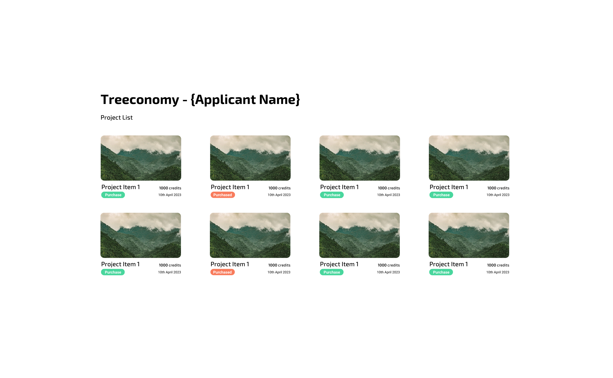

# tech-challenge

Treeconomy's Technical Challenge

# Solution

## About the React codebase

I've kept the state management really simple and used React's useState hook with React Query to handle the state and requests. react-query makes it really simple to manage caching and synchronization of server state and api data.
However, using this approach can have several consequences. Some of them are:
Performance Issues: Even though this is a very simple application written in React, the useState hook re-renders the component(or components if the state whose state is changing is also rendering child components). Since our state is stored at the app level, the frequency of clicking purchase button directly affects the performance of the app because changes in the state `processedData` will re-render all the project-items instead of just re-rendering the single project item whose purchase state is being affected.

# Overview and Steps

## 1. Setup challenge

An initial structure was prepared for the challenge, so you won't need to create the project from scratch.
In order to start the challenge, please do the following:

1. Clone this repo;
2. Run `yarn` or `npm install` depending on your preference (note: we've created it using `yarn`, hence the `yarn.lock` file);
3. Run `yarn start` or `npm start` to run the project and check that you see the following page:
   
4. This will be the base you will use for the challenge. Don't forget to read the rest of the README.md file carefully before you start :rocket:

## 2. Duration

We expect candidates to not take longer than **1.5 hours** to do the challenge. Please try to complete it within this duration :smile:
**Exercise 1**: 1 hour
**Exercise 2**: 30 minutes

**Note:** If you do't have enough time to do both exercises, feel free to hand in what you were able to complete! We prefer to see the logic you've used and what your thought process was.

## 3. Delivery

You can deliver your solution via GitHub or in a compressed format via email.

### GitHub

You can create a repo on your personal account and send us an invite to the repo - please send the link via email. Use `tech@treeconomy.co` for this and add `rob@treeconomy.co` as CC.

### Email

You can create a .zip package (or any other compressed format) with your full solution and send it to us via email - please use `tech@treeconomy.co` for this as well and add `rob@treeconomy.co` as CC.

**Note:** For both delivery options, please use the following subject format: `Name - Software Developer - Challenge Submission`

## 4. Considerations

- As mentioned previously, the challenge should be completed within an expected duration of 1.5 hours.
- You do not need to spend too much time making sure that the UI is exactly the same as the presented mockups, it does not need to be pixel perfect.
- We will be looking at code/file structure and reusable components. Bonus points for extra readable code and simple and efficient solutions :+1:
- If you want to let us know anything about your solution, you can use this README.md file to describe or write any explanation or details.
- This project is prepared for tests using React Testing Library, you can create your own unit tests for your solution (this is **not** mandatory).

## 5. Help

For any questions before, after or during the challenge, feel free to email `tech@treeconomy.co` or `francisco@treeconomy.co`.

## Good luck! :pray:

# Challenge

## Exercise 1

### Overview

For this exercise, you need to build a page with a grid of projects.

- Each project should display the image, the name of the project, the available credits and the start date of the project;
- The list should be **ordered by start date (descending)**;
- To fetch and render the project data, you need to use the datasource provided in the section below;
- Please add your name to the top header, as shown in the image;
- The grid should be responsive for different screen sizes - the number of items per row should be adaptable to the available width;
- Both fonts (Exo 2 and Roboto) are already imported and can be used directly;
- Each word of the project name should start in capital case;
- The start date should be presented in the following format - day month year - in which the month should be written.

### Data source

To fetch the project data: `https://sherwoodprojectdata.blob.core.windows.net/tech-challenge/projects.json`

### Design

## Exercise 2

### Overview

For this exercise, you need to add a **Purchase** button to each project item with the styling presented on the design below.
When the user clicks on the purchase button for each project, it should change it's state from `purchase` to **`purchased`** - and the style should change accordingly.

- If the user clicks on the **Purchased** button of a project, it should go back to it's initial state of **Purchase**;
- By default, all projects will be in the **Purchase** state, and you should be able to change one by one;
- If the user refreshes the page, it is expected that the projects will go back to their initial state and previous states will be lost;
- Please use the same project for this exercise as well, no need to duplicate it;

### Design

